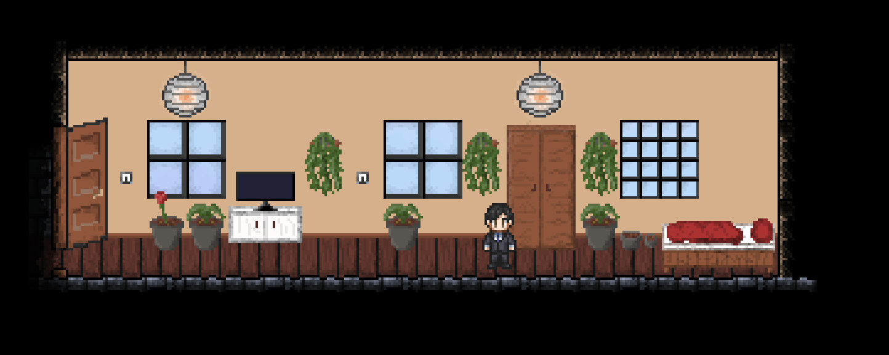
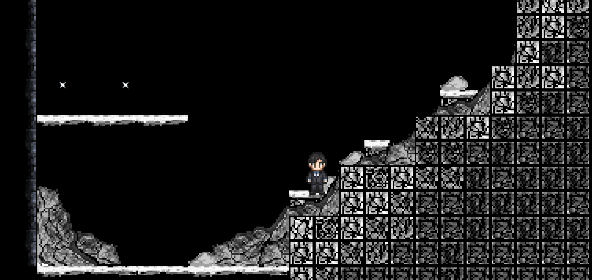

# 🎮 2D RPG Game

Game made with Godot Engine. It serves as practical part of our engineering degree.

* [Documentation](Project Documentation.pdf)
* This project uses Godot_v4.5-stable_win64.exe

## Authors

* [Szymon Ciechoński](https://github.com/szymiiiii)
* [Jan Drewienkowski](https://github.com/jd92910)

## How to install

* Open [Szymon Ciechoński](https://github.com/szymiiiii)
* Download and unarchive latest release
* Run Gra.exe inside main game folder

## Gameplay

## Some repo stats

